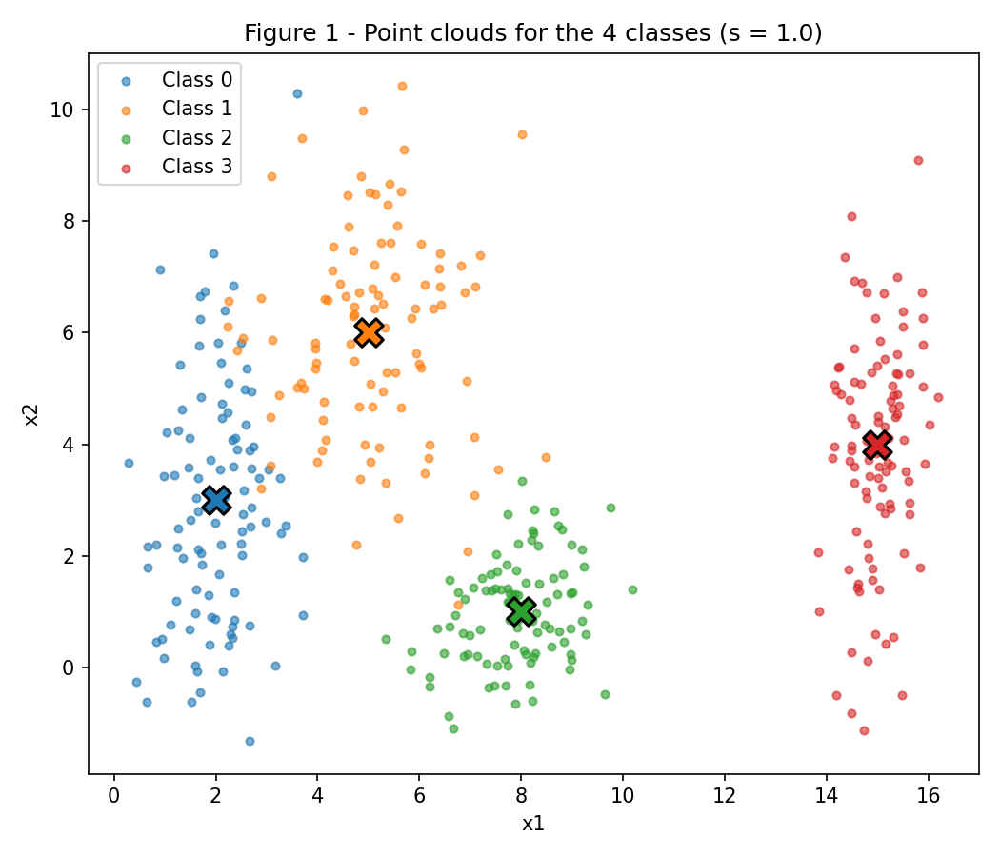
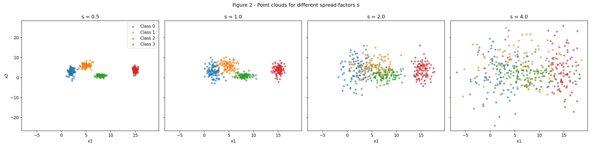
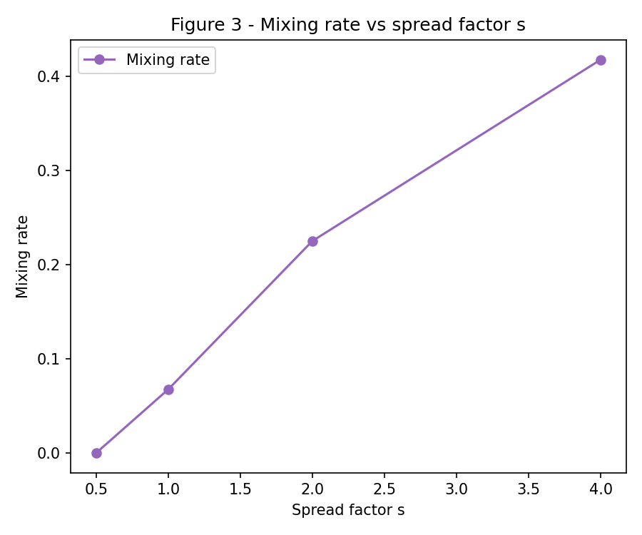
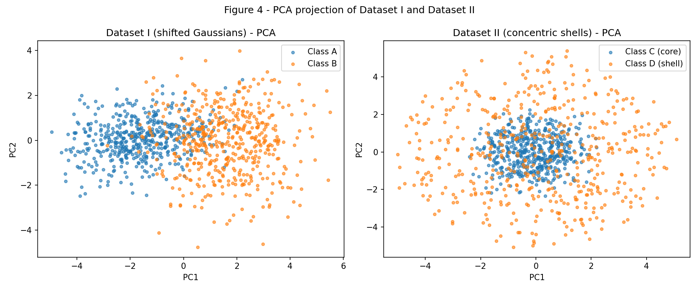
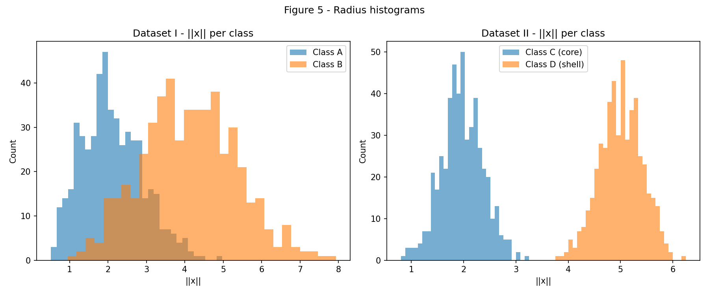
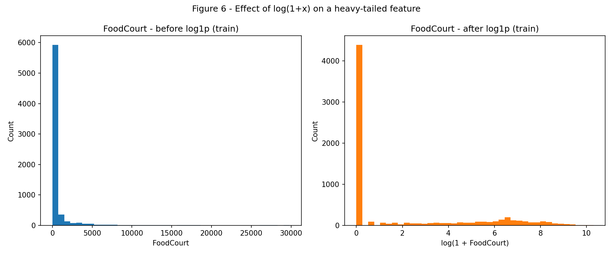

# Exercise 1: Data

All code below uses `rng = np.random.default_rng(42)` as the single random generator for the exercise, as required. No model is trained in this exercise.

## Exercise 1 - Point Clouds: Geometry and Spread in 2D

Full script for this exercise (`code/ex1_point_clouds.py`):

```python
--8<-- "docs/exercises/data/code/ex1_point_clouds.py"
```

### A — Generate the clouds

Four Gaussian classes were generated with 100 samples each (means and standard deviations as specified in the assignment).

**Figure 1**



### B — More or less spread out

The same 4 classes were regenerated 4 times, scaling all standard deviations by `s ∈ {0.5, 1.0, 2.0, 4.0}` while keeping the means fixed.

**Figure 2**



**Separation ratio `r_ij = ||μ_i - μ_j|| / (σ̄_i + σ̄_j)` at s = 1.0**

| Pair (i, j) | ‖μ_i − μ_j‖ | σ̄_i + σ̄_j | r_ij |
|---|---|---|---|
| (0, 1) | 4.243 | 3.200 | **1.326** |
| (0, 2) | 6.325 | 2.550 | 2.480 |
| (0, 3) | 13.038 | 2.900 | 4.496 |
| (1, 2) | 5.831 | 2.450 | 2.380 |
| (1, 3) | 10.198 | 2.800 | 3.642 |
| (2, 3) | 7.616 | 2.150 | 3.542 |

The smallest ratio is **r₀₁ = 1.326** (classes 0 and 1), meaning these are the two closest/least separated clouds. Since `r_ij` scales with `1/s` (the distance between means is constant, only the spread grows), at s = 2.0 the predicted smallest ratio is `1.326 / 2 = 0.663`.

**Mixing rate** (fraction of points whose nearest class mean is not their own, purely geometric, no training):

| s | Mixing rate |
|---|---|
| 0.5 | 0.000 |
| 1.0 | 0.068 |
| 2.0 | 0.225 |
| 4.0 | 0.417 |

**Figure 3**



Between s = 1.0 and s = 2.0 the mixing rate jumps sharply (from 6.8% to 22.5%), which is also where `r₀₁` crosses below ~1 (0.663 at s = 2.0). A ratio close to or below 1 means the distance between the two closest class centers is comparable to (or smaller than) the combined spread of the clouds, so from that scale on classes 0 and 1 can no longer be separated by a straight line without significant error.

### C — Analysis

At s = 1.0 classes 0 and 1 already overlap partially (smallest r_ij = 1.326, not very large), while classes 2 and 3 are further away and cleanly separated from the rest. A **single** straight line cannot separate all 4 classes at once, because they are arranged as 4 distinct regions, not two half-planes. However, a **set of linear boundaries** (e.g. one line separating {0,1} from {2,3}, plus one line splitting 0 from 1, plus one splitting 2 from 3) can approximate the 4 regions reasonably well at s = 1.0, since each pair is still reasonably compact.

Sketch (see `figures/figure1.png`): a neural network would likely learn boundaries that look like straight/piecewise-linear cuts roughly between class 0 and 1 (since they're closest and overlap most) and cleaner, further-apart cuts isolating classes 2 and 3.

As the clouds spread out more (increasing s), the overlap region between classes 0 and 1 grows and the network is necessarily forced to make errors precisely in that overlap region — points that fall geometrically closer to the *other* class's center than to their own can not be correctly classified regardless of the boundary chosen. This matches the rising mixing rate in Figure 3: the achievable error floor for any classifier grows with s.

---

## Exercise 2: Non-Linearity in Higher Dimensions

Full script for this exercise (`code/ex2_nonlinearity.py`):

```python
--8<-- "docs/exercises/data/code/ex2_nonlinearity.py"
```

### A — Dataset I: shifted Gaussians

500 samples per class were drawn from 5D multivariate normal distributions with the specified means and covariance matrices.

### B — Dataset II: concentric shells

500 samples per class were generated as random directions on the unit sphere in ℝ⁵ scaled by a class-dependent radius (core: ρ ~ N(2.0, 0.4); shell: ρ ~ N(5.0, 0.4)).

### C — Visualize and compare

**Figure 4**



**Explained variance of the first 2 principal components:**

| Dataset | PC1 + PC2 explained variance |
|---|---|
| Dataset I (shifted Gaussians) | **0.660** |
| Dataset II (concentric shells) | **0.429** |

Dataset I's 2D PCA projection preserves more of the total variance (66.0% vs 42.9%) and, since the two Gaussian blobs are shifted along a consistent direction, the classes remain visibly separated after projection. Dataset II is radially symmetric in all directions, so PCA — being a linear, variance-maximizing projection — cannot find a 2D subspace where the two shells (which differ in radius, not direction) look separated.

**Distance between class centers (in 5D) and radius histograms:**

| Dataset | ‖μ₁ − μ₂‖ |
|---|---|
| Dataset I | **3.228** |
| Dataset II | **0.266** |

**Figure 5**



### D — Analysis

1. In Dataset II the class centers are almost coincident (‖μ_C − μ_D‖ = 0.266, close to zero), yet the radius histograms (Figure 5, right) show two clearly separated peaks around ρ ≈ 2.0 and ρ ≈ 5.0. This tells us the classes differ in *how far from the origin* they are, not in *which direction* — a criterion that a linear hyperplane (which only measures position along one direction) cannot capture, since a hyperplane can't distinguish "close to the origin" from "far from the origin" in every direction simultaneously.

2. Dataset II's structure is radial: any hyperplane `w·x = b` divides ℝ⁵ into two unbounded half-spaces, but the two classes here occupy two *concentric spherical shells* — for every direction, there are points of both classes on both sides of any candidate hyperplane. So no choice of `w, b`, and no amount of additional data, can produce zero-error linear separation; more data only makes the two overlapping spherical distributions clearer, not more linearly separable.

3. PCA is a linear transformation, so a "mixed" 2D PCA projection does **not** by itself prove that the classes are inseparable in the original 5D space — it only proves that this *particular linear projection* fails. Our own results confirm this: the 5D radius histograms (Figure 5) show the two classes of Dataset II are almost perfectly separable using a simple **non-linear** function, even though their 2D PCA projection is mixed. Concretely, the function
   `f(x) = ||x||² = Σ xᵢ²`
   (or equivalently a threshold on `||x||`, e.g. classify as "shell" if `||x||² > 12`) separates the two classes of Dataset II almost perfectly, even though no linear function of `x` can.

---

## Exercise 3: Preparing Real-World Data for a Neural Network

*(Spaceship Titanic dataset, `train.csv`, from Kaggle.)*

Full script for this exercise (`code/ex3_preprocessing.py`):

```python
--8<-- "docs/exercises/data/code/ex3_preprocessing.py"
```

### A — Get to know the data

- `Transported` is the binary target: whether the passenger was transported to another dimension (`True`/`False`).
- Class balance is close to 50/50: **50.36% `True`, 49.64% `False`** (8693 rows total) — an almost perfectly balanced target.
- Numeric features: `Age, RoomService, FoodCourt, ShoppingMall, Spa, VRDeck`.
- Categorical features: `HomePlanet, CryoSleep, Destination, VIP` (plus `Cabin`/`Name`/`PassengerId`, which are dropped/engineered instead of used directly).

**Missing values per column:**

| Column | Missing count | Missing % |
|---|---|---|
| HomePlanet | 201 | 2.31% |
| CryoSleep | 217 | 2.50% |
| Cabin | 199 | 2.29% |
| Destination | 182 | 2.09% |
| Age | 179 | 2.06% |
| VIP | 203 | 2.34% |
| RoomService | 181 | 2.08% |
| FoodCourt | 183 | 2.11% |
| ShoppingMall | 208 | 2.39% |
| Spa | 183 | 2.11% |
| VRDeck | 188 | 2.16% |
| Name | 200 | 2.30% |

**Spend columns — mean, median, max (full dataset):**

| Column | Mean | Median | Max |
|---|---|---|---|
| RoomService | 224.69 | 0.0 | 14327.0 |
| FoodCourt | 458.08 | 0.0 | 29813.0 |
| ShoppingMall | 173.73 | 0.0 | 23492.0 |
| Spa | 311.14 | 0.0 | 22408.0 |
| VRDeck | 304.85 | 0.0 | 24133.0 |

For every spend column the mean is far above the median (which is exactly 0 in all of them), meaning most passengers spent nothing while a minority spent a lot — a strong **right-skew / heavy tail**, not a symmetric spread.

### B — Split before you transform

An 80/20 stratified split (by `Transported`, `random_state=42`) is performed **before** any imputation or scaling statistic is computed. Resulting shapes: **train = (6954, 14)**, **test = (1739, 14)**.

This ordering matters because any statistic (median, mean, category frequency, min/max) computed on the *full* dataset would leak information from the test set into the training pipeline — the model would implicitly "see" test-set characteristics during training, making the test performance estimate overly optimistic and not representative of truly unseen data.

### C — Preprocess

- **Missing data:** numeric columns are imputed with the **training-set median** (robust to the outliers/skew seen in the spend columns); categorical columns are imputed with the **training-set mode** (most frequent category). Both statistics are fit on the training set only and reused on the test set.
- **Categorical encoding:** `HomePlanet`, `CryoSleep`, `Destination`, `VIP` are one-hot encoded. The one-hot columns are fit on the training set; the test set is `reindex`-ed onto the training columns (`fill_value=0`), so any category seen only in the test set is effectively encoded as "none of the known categories" instead of crashing or creating a new column.
- **Feature engineering:** `TotalSpend` = sum of the 5 spend columns; `Cabin`, `Name`, `PassengerId` are dropped (high-cardinality / identifier columns not useful as raw numeric/categorical inputs).
- **Heavy tails:** `log(1 + x)` is applied to the 5 spend columns and to `TotalSpend`. This compresses the long right tail (most passengers spend 0, a few spend a lot), which otherwise would saturate a `tanh` activation and dominate the gradient for spend-related inputs.
- **Scaling:** Standardization (zero mean, unit variance) is fit on the training set and applied to both sets, which keeps most values close to `tanh`'s sensitive region ([-1, 1]) without hard-clipping outliers the way a fixed min-max normalization would.

**Spend columns stats on training set only, before any transformation** (used for imputation and to justify the log transform):

| Column | Mean | Median | Max |
|---|---|---|---|
| RoomService | 230.15 | 0.0 | 14327.0 |
| FoodCourt | 452.61 | 0.0 | 29813.0 |
| ShoppingMall | 170.03 | 0.0 | 12253.0 |
| Spa | 308.87 | 0.0 | 22408.0 |
| VRDeck | 296.65 | 0.0 | 20336.0 |

### D — Verify and visualize

**Figure 6**



**Final checks:**

- NaNs remaining in `X_train`: **0**; NaNs in `X_test`: **0**
- Final training feature matrix shape: **(6954, 17)**
- Value range after scaling: train min/max = **-6.537 / 6.537**; test min/max = **-6.537 / 6.537** (the extreme values on both sides come from a few rare one-hot categories; the standardized numeric features themselves stay much closer to the tanh-relevant range).

The preprocessing decision most likely to affect training the most is the **log(1+x) transform on the spend columns**: without it, the heavy-tailed raw values (max in the tens of thousands vs. a median of 0) would produce enormous standardized outliers, which combined with `tanh`'s saturation for large inputs would make gradients vanish for most training examples along those dimensions.

---

## Results summary

| # | Item | Value |
|---|------|-------|
| 1 | Mixing rate at s = 0.5 | 0.000 |
| 2 | Mixing rate at s = 1.0 | 0.068 |
| 3 | Mixing rate at s = 2.0 | 0.225 |
| 4 | Mixing rate at s = 4.0 | 0.417 |
| 5 | Smallest r_ij at s = 1.0 (pair) | 1.326 (pair 0–1) |
| 6 | Distance between centers — Dataset I | 3.228 |
| 7 | Distance between centers — Dataset II | 0.266 |
| 8 | Explained variance PC1+PC2 — Dataset I | 0.660 |
| 9 | Explained variance PC1+PC2 — Dataset II | 0.429 |
| 10 | Proportion of positive class in `Transported` | 50.36% |
| 11 | Mean/median of `FoodCourt` (train, pre-transform) | mean 452.61 / median 0.0 |
| 12 | Final training feature matrix shape | (6954, 17) |
| 13 | Min/max after scaling (train, test) | -6.537 / 6.537 (both sets) |
